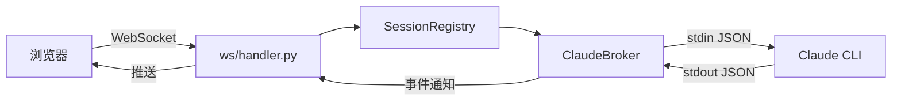

# Broker 与 stream-json 协议

ClaudeBroker 是 ClaudeMaster 的核心服务，管理所有本地 Claude CLI 子进程的生命周期。

## Broker 架构



ClaudeBroker 是一个**单例**，管理所有 Claude CLI 子进程：

- 启动子进程时使用 `claude -p --input-format stream-json --output-format stream-json --verbose --include-partial-messages`
- 通过 stdin 写入 JSON 消息，从 stdout 读取 JSON 事件
- 每个 `ClaudeSession` 维护订阅者列表，WebSocket handler 订阅事件并转发给浏览器

## stream-json 协议

Claude CLI 的 stream-json 是一种基于行的 JSON 流协议。

### 服务端 → 客户端（stdout 事件）

```json
// 初始化事件
{"type": "system", "subtype": "init", "session_id": "uuid"}

// 流式内容
{"type": "stream_event", "stream_event": {"type": "content_block_delta", ...}}

// 执行结果
{"type": "result", "stats": {"input_tokens": 1000, "output_tokens": 500, "cost_usd": 0.05}}

// 权限请求
{"type": "control_request", "request_id": "req-123", "request": {
    "type": "can_use_tool", "tool_name": "Bash", "input": {"command": "npm test"}
}}
```

### 客户端 → 服务端（stdin 消息）

```json
// 用户消息
{"type": "user", "message": {"role": "user", "content": "你好"}}

// 权限回复
{"type": "control_response", "request_id": "req-123", "behavior": "allow"}

// 中断
{"type": "control_request", "request_id": "int-1", "request": {"subtype": "interrupt"}}
```

## 会话生命周期

1. **启动**：`POST /api/chat/start` → Broker 创建 `ClaudeSession`，启动 CLI 子进程
2. **初始化**：CLI 输出 `system.init` 事件，Broker 捕获 `claude_session_id`
3. **交互**：浏览器通过 WebSocket 发送消息 → Broker 写入 stdin → CLI 输出事件 → Broker 通知订阅者
4. **权限**：CLI 发送 `control_request` → Broker 转发给浏览器 → 用户审批 → Broker 回写 stdin
5. **关闭**：`POST /api/chat/:id/stop` → Broker 终止子进程

## 双 ID 体系

每个 Broker 会话有两个 ID：

| ID | 说明 | 用途 |
|----|------|------|
| `session_id`（initial_id） | 启动时分配，稳定不变 | URL、WebSocket 连接、Broker 查找 |
| `claude_session_id` | Claude CLI 在 `init` 事件中分配 | JSONL 文件名、历史数据加载 |

在 `_sessions` 字典中，同一个 session 对象通过两个 key 索引。当两者相同时，`claude_session_id` 返回 null。

## 自动权限处理

在 `bypassPermissions` 模式下，Claude CLI 仍然会发送 `control_request`。Broker 检测到该模式时会自动回复 `allow`，不转发给前端。
