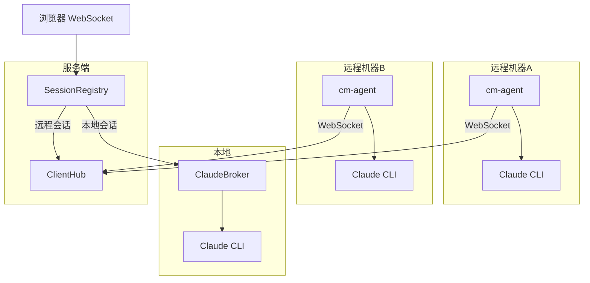

# 多客户端架构

ClaudeMaster v0.3.0 引入了多客户端接入架构，使远程机器上的 Claude Code 也能接入管理。

## 架构概览



## 核心组件

### cm-agent (`agent/cm_agent.py`)

客户端守护进程，在远程机器上运行，支持两种模式：

- **daemon 模式**（推荐）：常驻后台，按需启动/停止 Claude Code 会话，支持管理多个并行会话
- **oneshot 模式**（向后兼容）：启动一个 Claude CLI 子进程并接入
- 通过 WebSocket 连接到 ClaudeMaster 服务端
- 双向转发 Claude 事件和用户消息
- 定期上报远程进程列表和会话摘要
- 断线自动重连（指数退避，最大 30 秒）

### ClientHub (`backend/services/client_hub.py`)

服务端的远程连接管理器：

- 维护所有 `AgentConnection`（每个 cm-agent 守护进程一个）和 `RemoteSession` 实例
- `RemoteSession` 继承自 `BaseSession`，与 `ClaudeSession` 共享统一接口
- 处理 agent 注册、断线重连、超时清理（300 秒断线保持）
- 支持向 daemon agent 发送 `start_session` / `stop_session` 命令
- 管理 pending requests（Future），实现请求-响应模式
- 提供 `resolve_pending_request()` 方法封装私有状态访问

### SessionRegistry (`backend/services/session_registry.py`)

统一的会话索引层：

- 合并 Broker（本地）和 ClientHub（远程）的会话
- 提供统一的 `get_session`、`list_all_sessions` 接口
- 自动路由 `send_message`、`send_control_response`、`send_interrupt` 到正确的后端
- 上层代码（WebSocket handler、路由）无需关心会话来源

## 通信协议

### Agent → 服务端

```json
// 注册（daemon 模式）
{"type": "register", "hostname": "my-laptop", "mode": "daemon",
 "allowed_paths": ["/home/user/projects"], "agent_version": "0.2.0"}

// Claude stdout 事件转发
{"type": "event", "session_id": "...", "event": {"type": "system", "subtype": "init", ...}}

// Claude 进程退出
{"type": "agent_status", "session_id": "...", "status": "claude_exited", "exit_code": 0}

// 进程和会话列表上报
{"type": "processes", "items": [...], "sessions": [...]}

// 会话启动结果
{"type": "session_started", "request_id": "...", "session_id": "..."}
```

### 服务端 → Agent

```json
// 注册确认
{"type": "registered", "agent_id": "...", "mode": "daemon"}

// 启动远程会话
{"type": "start_session", "request_id": "...", "project_path": "/home/user/project",
 "claude_args": ["--model", "opus"], "name": "swift-fox"}

// 停止远程会话
{"type": "stop_session", "session_id": "..."}

// 网页用户消息
{"type": "user_message", "text": "请修复这个 bug", "source": "web", "session_id": "..."}

// 权限回复
{"type": "control_response", "request_id": "req-1", "behavior": "allow", "session_id": "..."}

// 心跳
{"type": "ping", "ts": 1234567890}
```

## RemoteSession 状态

远程会话的状态与本地会话一致：

| 状态 | 说明 |
|------|------|
| `starting` | 刚注册，等待 Claude 初始化 |
| `idle` | Claude 空闲，等待输入 |
| `streaming` | Claude 正在生成回复 |
| `waiting_permission` | 等待工具权限审批 |
| `disconnected` | agent 断线，等待重连（5 分钟超时） |
| `closed` | 会话已结束 |

## 前端适配

远程会话在前端的表现：

- 工作台上会话卡片显示来源标记（`remote`）和主机名
- `GET /api/chat/sessions` 返回的会话列表包含 `source`、`hostname`、`client_id` 字段
- 所有交互操作（发消息、审批权限、中断）通过 SessionRegistry 统一路由，前端无需区分来源
