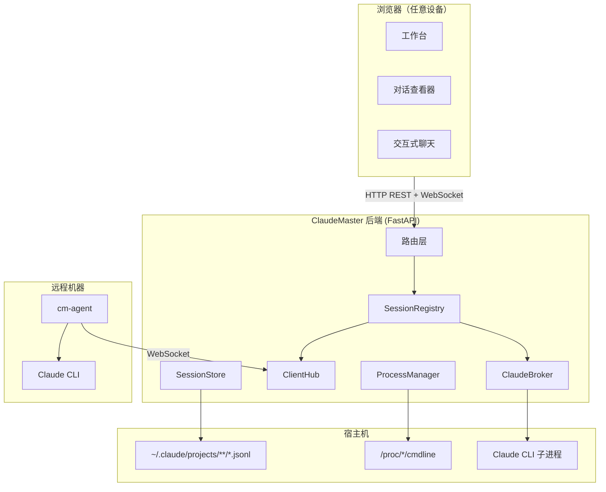

# 系统架构总览

## 整体架构



## 后端：Python + FastAPI

**为什么选择 Python + FastAPI：**

- 原生异步——WebSocket 和文件监听所必需
- Pydantic 数据校验——干净、有类型的数据模型
- 样板代码极少——一个路由文件约 30 行
- 非常适合 AI 辅助开发——Python 是 AI 模型理解得最好的语言

## 前端：TypeScript + Lit Web Components

**为什么选择 Lit Web Components：**

- 零框架锁定——标准 Web Components API
- 运行时极小（~5KB），对比 React（~40KB）
- 每个组件是独立文件——非常适合 AI 独立修改
- 浏览器原生标准——不会被框架迭代淘汰

## 通信方式

| 场景 | 协议 | 原因 |
|------|------|------|
| 会话列表、历史 | REST GET | 静态数据，可缓存 |
| 对话内容 | REST GET | 加载一次，内容不变 |
| 实时对话流 | WebSocket | 实时性，服务器推送 |
| 进程控制 | REST POST | 一次性操作 |
| Agent 接入 | WebSocket | 长连接，双向通信 |

## 项目结构

```
ClaudeMaster/
├── backend/
│   ├── main.py                    # FastAPI 应用入口
│   ├── config.py                  # 全局配置
│   ├── routers/                   # API 路由
│   │   ├── sessions.py            # 会话 CRUD + 搜索
│   │   ├── chat.py                # 交互式会话 API
│   │   ├── processes.py           # 进程检测
│   │   └── ...
│   ├── services/
│   │   ├── session_store.py       # JSONL 解析与缓存
│   │   ├── claude_broker.py       # Claude CLI 子进程管理
│   │   ├── client_hub.py          # 远程 agent 连接管理
│   │   ├── session_registry.py    # 统一会话索引
│   │   └── ...
│   ├── models/                    # Pydantic 数据模型
│   └── ws/
│       ├── handler.py             # 浏览器 WebSocket
│       └── agent_handler.py       # Agent WebSocket
│
├── frontend/src/
│   ├── pages/                     # 页面组件
│   ├── components/                # 可复用 UI 组件
│   ├── services/                  # 客户端服务
│   └── utils/                     # 工具函数
│
└── agent/
    └── cm_agent.py                # 远程 sidecar 客户端
```

## 设计原则

- **清晰优于精巧**：每个文件职责单一，数据流显式
- **模块隔离**：每个模块可独立理解、修改和测试
- **类型化接口**：Python 用 Pydantic + 类型标注，TypeScript 用严格模式
- **约定优于配置**：Python `snake_case`、TypeScript `camelCase`
- **上下文自包含**：每个源文件开头注释说明用途，API 端点自带文档
