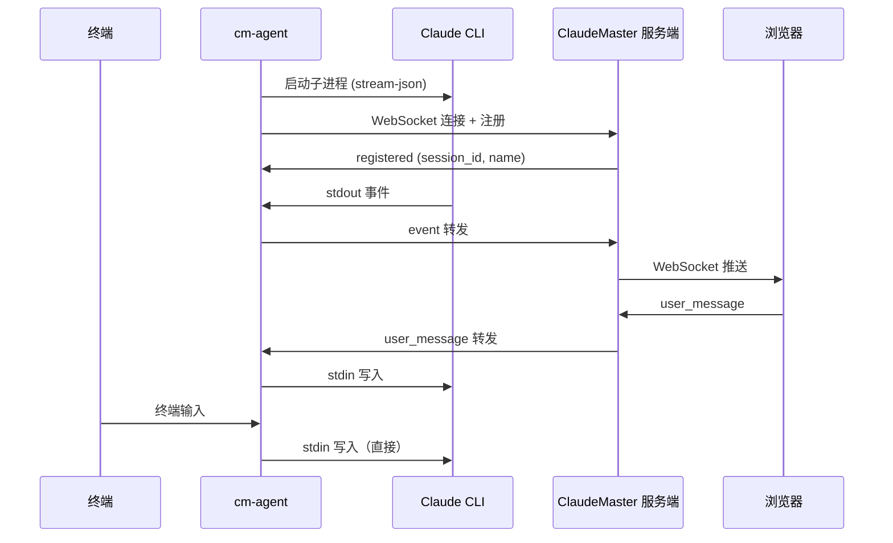

# cm-agent 远程接入

cm-agent 是一个轻量 sidecar 程序，将任意机器上运行的 Claude Code 接入 ClaudeMaster 服务端。

## 工作原理



cm-agent 同时支持**终端交互**和**网页交互**——你可以在终端直接输入，也可以从浏览器发送消息，两端共享同一个 Claude 会话。

## 安装

cm-agent 只需要 Python 和 `websockets` 库：

```bash
pip install websockets
```

## 用法

```bash
python agent/cm_agent.py \
  --server ws://your-server:8420 \
  --token your-auth-token \
  --project /path/to/project
```

### 参数说明

| 参数 | 简写 | 默认值 | 说明 |
|------|------|--------|------|
| `--server` | `-s` | （必填） | ClaudeMaster 服务端地址 |
| `--token` | `-t` | `$CM_AUTH_TOKEN` | 认证令牌 |
| `--project` | `-p` | 当前目录 | 项目工作目录 |

### 透传 Claude 参数

`--` 之后的所有参数会直接传给 Claude CLI：

```bash
# 恢复已有会话
python agent/cm_agent.py -s ws://server:8420 -- --resume abc123

# 指定模型
python agent/cm_agent.py -s ws://server:8420 -- --model claude-sonnet-4-20250514
```

### 环境变量

| 变量 | 说明 |
|------|------|
| `CM_AUTH_TOKEN` | 认证令牌（替代 `--token`） |
| `CLAUDE_BIN` | 自定义 Claude CLI 路径 |

## 连接管理

- **断线重连**：agent 与服务端断开后会自动重连，初始延迟 1 秒，指数退避，最大 30 秒
- **会话保持**：服务端在 agent 断开后保留会话 5 分钟，期间重连可恢复
- **优雅关闭**：收到 SIGINT/SIGTERM 时，agent 会终止 Claude 子进程并通知服务端

## 在浏览器中使用

agent 连接后，会话自动出现在 ClaudeMaster 工作台上：

- 来源显示为 **remote**，附带主机名
- 支持与本地会话相同的所有操作：查看输出、发送消息、审批权限、中断执行
- 权限请求可在终端或网页任一端处理

!!! tip "HTTPS 连接"
    如果服务端使用 HTTPS，agent 连接地址应使用 `wss://`：
    ```bash
    python agent/cm_agent.py -s wss://your-server:8420 --token secret
    ```
