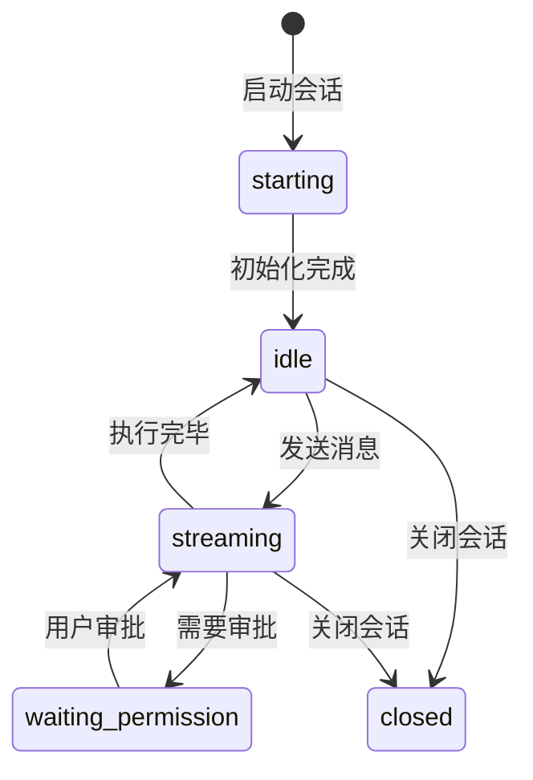

# 工作台

工作台是打开 ClaudeMaster 后的首页（`#/dashboard`），一目了然地展示所有 Claude Code 活动。

## 区块划分

工作台分为以下区块，按优先级从上到下排列：

| 区块 | 状态点颜色 | 显示条件 | 包含内容 |
|------|-----------|---------|---------|
| **待审批** | 橙色闪烁 | 有会话等待工具权限审批 | `state=waiting_permission` 的会话 |
| **工作中** | 绿色闪烁 | 有 agent 正在执行 | `state=streaming` 或 `starting` 的会话 |
| **待命中** | 蓝色 | 有进程存活但空闲 | `state=idle` 的会话 + Legacy 进程 |
| **最近会话** | 灰色 | 始终显示 | 所有 JSONL 历史会话 |

!!! info "卡片类型"
    - **会话卡片**：展示项目名、Git 分支、首条消息、最近助手回复、统计指标
    - **进程卡片**：展示 PID、运行时长（用于无 JSONL 匹配的 legacy 进程）
    - **待审批卡片**：高亮显示等待审批的工具名称，点击进入会话审批

## 状态流转

## 新建会话

点击工作台右上角的「+ 新建会话」按钮，弹出配置对话框：

- **项目目录** — Claude Code 的工作目录
- **模型** — 使用的 Claude 模型
- **权限模式** — 自动批准 (`bypassPermissions`) 或手动审批
- **预算上限** — 最大花费（USD）
- **最大轮数** — 自动停止的对话轮数
- **追加系统提示** — 附加到 Claude 系统提示的自定义指令

确认后，ClaudeMaster 会启动 Claude Code 子进程，并自动跳转到对话查看器。

## 徽章规则

- **"运行中"** 徽章仅在 **工作中** 区块的卡片上显示
- **待命中** 区块的卡片不显示 "运行中"（进程在跑但空闲）
- **最近会话** 区块的卡片不显示 "运行中"（历史记录）
